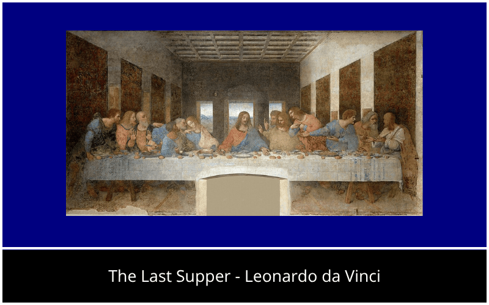

  
   
  

   
  
  

 

  <h2>👋 About Me</h2>
  

    <b>I don't just write code — I create solutions!</b> 💡 
    I'm <b>Leandro</b>, a <b>Junior Full Stack Developer</b> from Brazil, fueled by a passion for solving problems and a commitment to continuous growth.
  

  
  

    <blockquote>
      <i>A motivational quote for those who enjoy it:</i> 
      <i>"I am not bound to succeed, but I am bound to live by the light that I have."</i> 
      <b>- Abraham Lincoln</b>  
      <i>And yes, I discovered that quote in a Cbum video.</i>
    </blockquote>
  

  
   
  
  

    💼 <b>Working at:</b> <a href="https://www.vitao.com.br/sobre-nos/">Vitao Alimentos</a> 
    🌱 <b>Learning:</b> PHP, Laravel, Java, Spring Boot, HTML, JavaScript and SQL. 
    ⚡ <b>Fun Fact:</b> I think I'm funny — and my code works... well, most of the time.
  

  
  <h3>🛠 Tech Stack</h3>
  

    <a href="https://skillicons.dev">
       
      
    </a>
  

 

  <h2>📊 My Contributions</h2>
  
<i>Oh no! The snake is eating them! Stop her! 🐍</i>

  <picture>
    <source media="(prefers-color-scheme: dark)" srcset="https://raw.githubusercontent.com/Leandro-Cedoski/Leandro-Cedoski/output/github-contribution-grid-snake-dark.svg?v=1">
    <source media="(prefers-color-scheme: light)" srcset="https://raw.githubusercontent.com/Leandro-Cedoski/Leandro-Cedoski/output/github-contribution-grid-snake.svg?v=1">
    
  </picture>

 

  <h2>🎨 Beyond Code: A Pill of Art</h2>
  
<i>Because life isn't just about syntax and logic. Stop for a moment and grab your art pill.</i>

  
  
    
  
<small>Select a song to play and enjoy:</small>

   

  

    
    &nbsp;
    
    &nbsp;
    
  

  

    
    &nbsp;
    
    &nbsp;
    
  

 

  

